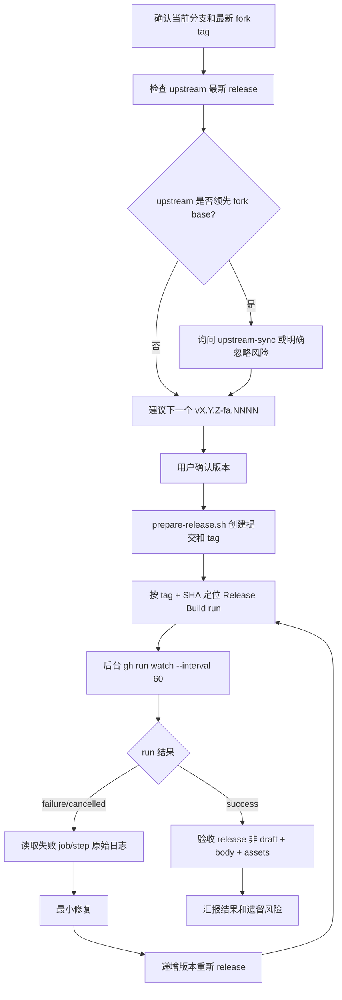

# Release — clash-verge-rev

## 边界

- 普通 release 只走 `v{upstream_version}-fa.{increment}` tag。
- 若 upstream 已有新普通 release，默认暂停并转 upstream-sync；用户明确忽略时，确认和最终汇报都要标注风险。
- 不要直接 `git tag && git push`；必须通过 `./scripts/prepare-release.sh <TAG>` 生成 Changelog 和同步版本号。
- 外部发布、删除 release/tag、force overwrite 都属于 public surface；工具被拦时让用户执行，不要绕过。

## 流程



## 必跑步骤

### 1. 版本和 upstream gate

```bash
git fetch origin --tags --force
git fetch upstream --tags --force || true

LATEST_TAG=$(git tag --sort=-version:refname | grep -E '^v[0-9]+\.[0-9]+\.[0-9]+-fa\.[0-9]+$' | head -1)
FORK_BASE=$(printf '%s\n' "$LATEST_TAG" | sed -E 's/^(v[0-9]+\.[0-9]+\.[0-9]+)-fa\.[0-9]+$/\1/')
UPSTREAM_LATEST=$(gh api repos/clash-verge-rev/clash-verge-rev/releases/latest --jq '.tag_name')
```

- 若 `UPSTREAM_LATEST` > `FORK_BASE`：询问用户 `先 upstream-sync（推荐）` / `忽略并继续`。
- 忽略继续时，在确认和最终汇报写明：`⚠️ 基于 {FORK_BASE}，upstream {UPSTREAM_LATEST} 尚未合并`。

### 2. 建议版本

- 同一 upstream base：递增 4 位数，如 `v2.5.2-fa.1003` → `v2.5.2-fa.1004`。
- 新 upstream base：从 `fa.1001` 开始。
- 用户确认后执行：

```bash
./scripts/prepare-release.sh v2.5.2-fa.1004 --yes
```

### 3. 定位本次 run

必须用 tag + tag SHA 精确定位；不要拿最近一个 push run。

```bash
TAG=v2.5.2-fa.1004
TAG_SHA=$(git rev-list -n 1 "$TAG")

RUN_ID=$(gh run list \
  --workflow='Release Build' \
  --limit=20 \
  --json databaseId,headBranch,headSha,event \
  --jq 'map(select(.event == "push" and .headBranch == '"\"$TAG\""' and .headSha == '"\"$TAG_SHA\""')) | .[0].databaseId')

gh run view "$RUN_ID" --json status,conclusion,jobs \
  --jq '{status,conclusion,jobs:[.jobs[]|{name,status,conclusion}]}'
```

### 4. 等待方式

- 先做一次状态快照。
- 若 `queued` / `in_progress`，用后台任务等待：

```bash
gh run watch "$RUN_ID" --interval 60 --exit-status
```

- 不要短间隔重复 `gh run view`；只在阶段变化时汇报。
- 等待超过 30 分钟不是失败；查当前 job/step，说明仍在跑还是卡住。

### 5. 验收

```bash
gh release view "$TAG" --json isDraft,isPrerelease,body,assets,url \
  --jq '{isDraft,isPrerelease,hasBody:(.body|length>50),assetCount:(.assets|length),assetNames:[.assets[].name],url}'
```

验收标准：

- `isDraft == false`
- `isPrerelease == false`（除非用户明确要 rc）
- body 有实质内容且包含当前 tag
- assets 至少包含 Windows / macOS / Linux 产物；当前 fork 预期约 10 个 assets（含 `.sig` 和 `latest.json`）

## 失败诊断不变量

- 失败必须引用具体 job、step、原始错误片段；不要只按 job 名猜。
- run 未完成时，`gh run view --log-failed` 可能不可用；先用 jobs JSON 或 jobs API 定位失败 step。
- run 完成后再用：

```bash
gh run view "$RUN_ID" --log-failed
gh run view "$RUN_ID" --job <JOB_ID> --log
gh api repos/iuin8/clash-verge-rev/actions/jobs/<JOB_ID>/logs > job.log
```

- Windows runner 默认 shell 是 PowerShell；跨平台 step 里不要写裸 `export`。需要 bash 时显式 `shell: bash`，或独立 bash step 写 `$GITHUB_ENV`。
- `$GITHUB_ENV` 只影响后续 step，不影响同一 step 后续命令。
- 修复后递增新版本重发，最多 3 次；第 3 次仍失败时停止并输出诊断摘要。
- 同名版本重发必须先清旧 release + tag：`gh release delete <TAG> --yes --cleanup-tag`；只删 tag 会留下 draft release，导致重复 release 失败。

## clash-verge 专项检查

触及 `scripts/prebuild.mjs`、service IPC、TUN/Service、macOS signing 时：

- service binary 版本必须和 `Cargo.lock` 的 `clash_verge_service_ipc` client 对齐；不要让 `releases/latest` 先于 app client 漂移。
- 小冲突面优先：通过 workflow 显式传入 service 版本，保留 `prebuild.mjs` 下载/解包主逻辑。
- macOS 包必须有 `.app/Contents/_CodeSignature/CodeResources`；release 后仍需关注运行时 helper bundle 和 IPC socket。
- `Install Service failed: IPC path not ready` 优先查实际 service socket 路径、client `IPC_PATH`、helper bundle 签名和 launchd 状态。

## 相关文件

- `scripts/prepare-release.sh`
- `scripts/release-version.mjs`
- `.github/workflows/release.yml`
- `scripts/prebuild.mjs`
- `scripts/verify-macos-signing.sh`
- `.claude/skills/upstream-sync/SKILL.md`
