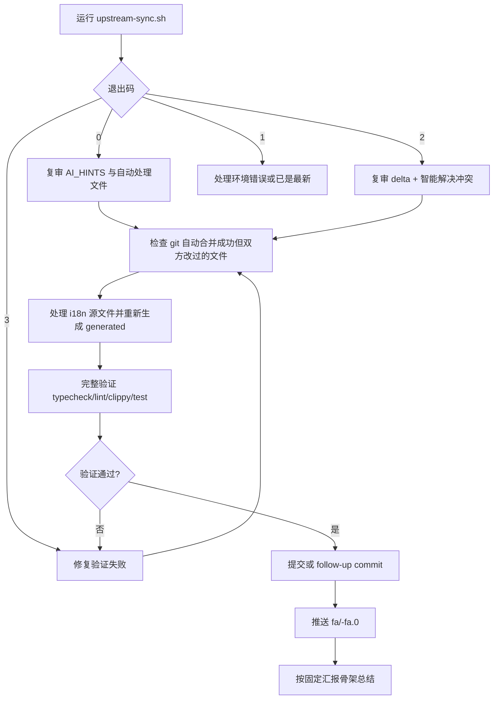

# Upstream Sync — clash-verge-rev

## 边界

- 本 skill 是本地手动 / AI 驱动同步路径；CI 自动 PR 流程见 `.github/UPSTREAM_SYNC_GUIDE.md`。
- 目标分支命名：`fa/<TARGET_TAG>-fa.0`。
- 核心策略：**不要无脑 ours/theirs**；每个冲突文件都要“上游 delta → fork 意图 → 融合决策 → 验证”。
- `Changelog.md` 可自动 `--ours`；其余冲突默认智能合并。
- 详细冲突类型参考 `.github/CONFLICT_RESOLUTION_GUIDE.md`；本 skill 只保留执行不变量。

## 流程



## 必跑步骤

### 1. 运行脚本

```bash
./.claude/skills/upstream-sync/upstream-sync.sh
# 指定版本: ./.claude/skills/upstream-sync/upstream-sync.sh v2.5.2
# 仅预检:   ./.claude/skills/upstream-sync/upstream-sync.sh --check-only
# 跳过脚本快速验证: ... --no-verify  # 不能跳过本 skill 的完整验证
```

退出码含义：

- `0`：脚本完成快速验证；仍必须做复审和完整验证。
- `2`：有 `SMART_MERGE_REQUIRED`，按 AI_HINTS 解决冲突。
- `3`：合并完成但快速验证失败；先修复再完整验证。
- `1`：环境错误 / 已是最新；读 stderr 后处理。

### 2. 复审上游 delta

脚本从版本字段推导 `PREV_TAG` / `TARGET_TAG`；直接用 AI_HINTS。

```bash
for f in <AI_HINTS 中的冲突文件 + GIT_OVERLAP_FILES>; do
  echo "=== $f ==="
  git log --oneline "$PREV_TAG".."$TARGET_TAG" -- "$f"
  git diff "$PREV_TAG".."$TARGET_TAG" -- "$f"
done
```

决策矩阵：

| 情况 | 决策 |
| --- | --- |
| 上游 bug fix / 安全补丁 / CVE | 必须吸收；若碰到 fork 区，移植修复原理 |
| `// FORK:` 块 vs 上游重构 | 保留 fork 意图，在上游新结构上重植 |
| 依赖 / Cargo / package 升级 | 接受上游，验证 fork 兼容 |
| 版本 / updater signing | 保留 fork `version` / `pubkey` / `endpoints`，吸收新配置项 |
| fork 禁用 job (`if:false`) | 保留禁用意图，但吸收启用 job 的结构和 `needs:` 修复 |
| 模糊地带 | 标 `NEEDS_USER_REVIEW`，不要自作主张 |

### 3. 智能合并

对每个冲突文件必须读三份上下文：

```bash
cat <file>
git diff "$PREV_TAG".."$TARGET_TAG" -- <file>
git diff "$PREV_TAG"...HEAD -- <file>
grep -En 'FORK:|multi_merge|merged|merge_conflicts|selectedProfiles' <file>
```

按文件类处理：

- **功能集成**：`enhance/mod.rs`、`cmd/profile.rs`、`config/profiles.rs`、`lib.rs`、`profiles.tsx`、`profile-{box,item}.tsx` 等；保留 multi-profile merge，吸收上游修复。
- **无标记 fork 改动**：`src/services/cmds.ts`、`src/types/global.d.ts`、`settings.tsx`、`update-viewer.tsx` 可能没有 `// FORK:`；必须用 `git diff "$PREV_TAG"...HEAD -- <file>` 补扫。
- **i18n 源**：`src/locales/*/profiles.json` 并集合并，保留 fork keys 和上游改文案。
- **i18n 生成物**：`src/types/generated/i18n-{keys,resources}.ts` 不手改；合完 locales 后跑 `pnpm i18n:types`。
- **CI / 发布脚本**：保留 fork URL、禁用 job、fork 发布策略；吸收上游对启用 job、action 版本、权限、`needs:` 的修复。

完成后统一：

```bash
git add <resolved files> src/locales/*/profiles.json src/types/generated/i18n-keys.ts src/types/generated/i18n-resources.ts
git status  # 必须无 UU/AA/冲突标记
```

### 4. 完整验证

```bash
pnpm i18n:types
pnpm install
pnpm typecheck
pnpm lint
cargo clippy-all
cargo fmt -- --check
cargo test
# 可选重型最终验证：pnpm build
```

额外静默风险检查：

```bash
grep -q 'iuin8/clash-verge-rev' src-tauri/tauri.conf.json || echo '❌ updater endpoint 不是 fork'
jq -r '.version' package.json  # 期望 <TARGET>-fa.N
```

### 5. 提交 / 推送 / 汇报

- 脚本已提交时：复审/修复作为 follow-up commit。
- 手动完成冲突时：提交合并结果。

```bash
git log --oneline -8
git push -u origin fa/<TARGET_TAG>-fa.0
```

最终汇报只进对话，不落盘，按 6 句组织：

1. 自动处理文件复审结论。
2. 版本 / 签名 / CI 保留和吸收点。
3. 功能集成智能合并策略。
4. 连带影响、无标记 fork 改动、i18n 生成处理。
5. 验证命令和推送 short SHA。
6. `NEEDS_USER_REVIEW` 与非阻塞异步事项。

## fork 改动范围

核心 fork 功能：**多订阅合并 (multi-profile merge)**。

- 新增文件：`src-tauri/src/enhance/multi_merge.rs`、`conflict-viewer.tsx`、`merge-order-bar.tsx`、`scripts/prepare-release.sh`、`.github/workflows/upstream-sync.yml`。
- 高风险共享文件：Rust `enhance/cmd/config/core/lib` 集成点、React profiles/profile components、版本/签名文件、release/updater/prebuild 脚本、locales 和 generated i18n。
- 无标记改动尤其要补扫：`cmds.ts`、`global.d.ts`、fork GitHub URL 替换。

## Red Flags

- “脚本退出码 0 = 完成”——错，仍需复审和完整验证。
- “git 没冲突 = 语义没问题”——错，fork 独有文件可能编译期才炸。
- “generated i18n 手改即可”——错，必须从 locales 重新生成。
- “tauri.conf.json 直接取上游”——错，会断 updater `pubkey` / `endpoints`。
- “同步完顺手发布”——错，本 skill 止于可推送分支；发布走 release skill。
