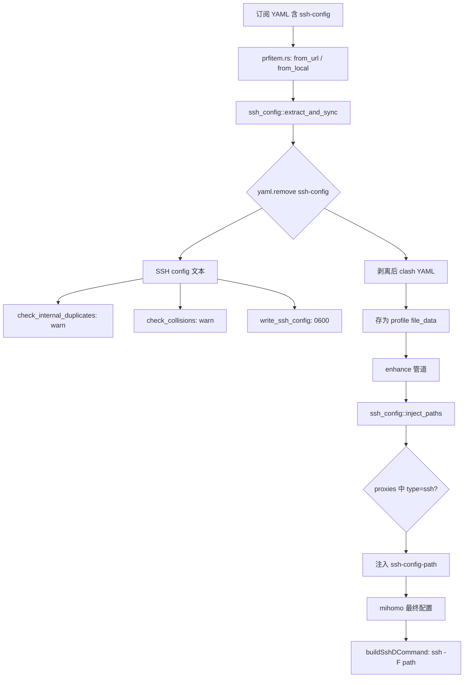

# SSH Config Profile Integration — Design Spec

**Date:** 2026-08-13
**Status:** Implemented
**Scope:** clash-verge-rev (fork) + mihomo (fork)

---

## Overview

让订阅配置 YAML 支持内嵌系统级 SSH config，实现"代理订阅 + SSH 配置"一体化。用户在订阅文件里用 `ssh-config: |` 字面量块写 OpenSSH `ssh_config(5)` 内容，导入时自动提取、托管、注入，实现一键式使用。

**核心原则：** 不写用户 `~/.ssh/config`，不自动加 `Include`（避免循环引用），主动权交给用户。

---

## 文件格式

```yaml
proxies:
  - name: my-ssh-proxy
    type: ssh
    server: my-jump-host
    use-system-socks: true

ssh-config: |
  Host my-jump-host
      HostName 10.0.0.1
      User ubuntu
      IdentityFile ~/.ssh/id_ed25519

  Host *.internal
      ProxyJump my-jump-host

  # 用户可手动 Include 链回自己的主配置
  # Include ~/.ssh/config
```

**为什么是 `ssh-config: |` 而不是 `---` 分隔符：**

| | `---` 分隔 | `ssh-config: |` |
|---|---|---|
| YAML 合规 | ❌ 第二个文档非 YAML | ✅ 单文档，完全合法 |
| 解析 | `\n---\n` 字符串匹配，易误拆分（字面量块内 `---`） | `mapping.remove("ssh-config")` |
| 工具链兼容 | ❌ 标准 YAML parser 报错 | ✅ 任何 YAML 工具可读 |

**场景：** 仅代理（无 `ssh-config` key）、仅 SSH（有 key 无 `proxies`/`proxy-providers`）、混合。三者都支持。

---

## 数据流



---

## 托管目录与生命周期

```
~/.clash-verge-rev/ssh-configs/<uid>.conf   # 每个 profile 一个文件，0600
```

| 事件 | 行为 | 代码位置 |
|------|------|----------|
| 导入/更新 profile | 写 `<uid>.conf`；无 ssh-config 时删除旧文件 | `extract_and_sync` |
| 删除 profile | 删除 `<uid>.conf` | `profiles.rs: delete_item` |
| 启动清理 | 删无对应 profile 的孤儿文件 | `profiles.rs: cleanup_orphaned_files` |

---

## 冲突检测语义

对齐 SSH 原生 **first-match-wins**，只 warn 不阻塞：

| 冲突 | 处理 |
|------|------|
| 同一文件内重复 Host | warn：「只有第一处生效」 |
| 跨 profile 同名 Host | warn：「后导入者胜」 |
| 通配符 Host（`*`、`*.internal`） | `parse_host_names` 跳过，不参与检测 |

---

## 与 mihomo 的配合

clash-verge-rev 注入 `ssh-config-path` 到 `type: ssh` 代理 → mihomo `SshOption.SshConfigPath` 接收 → `buildSshDCommand` 生成 `ssh -F <path> -D ...`。

**文件缺失 fallback：** `buildSshDCommand` 用 `os.Stat` 校验，缺失时去掉 `-F` 回落 `~/.ssh/config`，不阻塞隧道启动。

---

## Fork 冲突面

核心逻辑 100% 收敛到新文件 `src-tauri/src/module/ssh_config.rs`，上游文件只留 1-2 行 hook：

| 文件 | 改动量 | 归属 |
|------|--------|------|
| `module/ssh_config.rs` | **新文件** | 零冲突 |
| `module/mod.rs` | 1 行（注册模块） | 上游 |
| `config/prfitem.rs` | `extract_and_sync` 调用（2 处） | 上游 |
| `config/profiles.rs` | 删除/清理联动（2 处） | 上游 |
| `enhance/mod.rs` | `current_uid` 字段 + `inject_paths` 调用 | 上游 |

---

## 验证

- `ssh_config.rs` 单测：`parse_host_names`、`check_internal_duplicates`（4 tests）
- `cargo check` / `cargo clippy --all-targets` / `cargo fmt --check` 零 warning
- mihomo：`go test ./adapter/outbound/...` 全部通过；`buildSshDCommand` 的 `-F` 注入/省略/文件缺失 3 个测试
